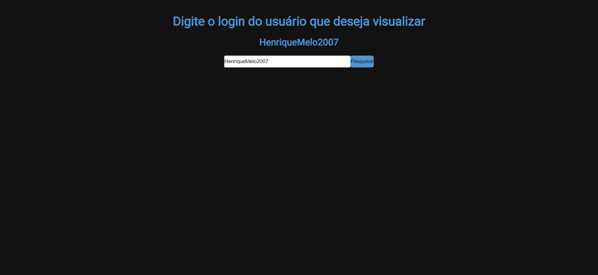
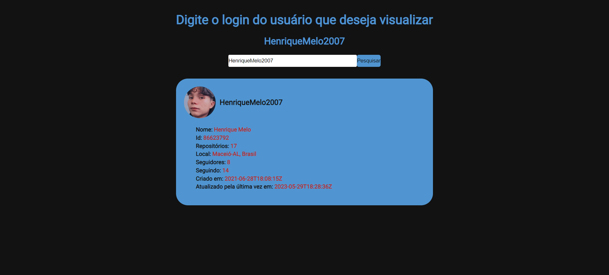

# Visualizador-usuários-GitHub

> Informação:

Aplicação Feita em React que possibilita utilizar login de qualquer usuário da plataforma GitHub para obter suas respectivas informações de conta.

## Layout

## 🛠 Tecnologias:

- HTML
- CSS
- JavaScript
- React

## 📲 Contato:

henriquemelo0983@gmail.com